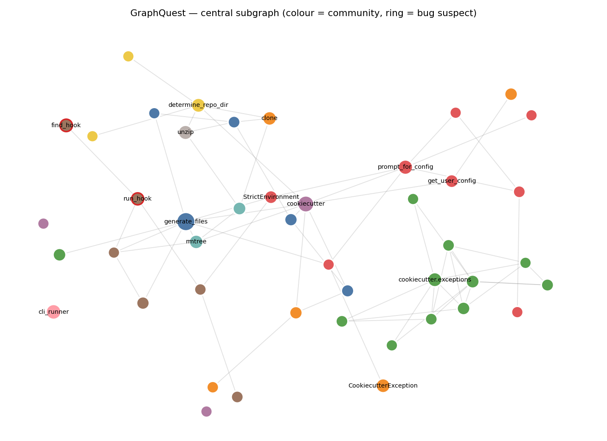
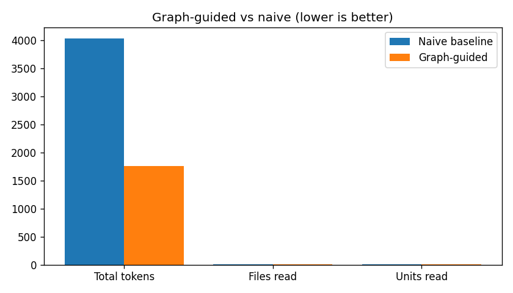

# GraphQuest — Graph-Guided, Token-Efficient Debugging of an Unfamiliar Codebase

> HW4 · EX04 · Course: Building with LLMs (Dr. Yoram Segal)
> Group: **moamteam** · Version: **1.00**

GraphQuest reverse-engineers an **unfamiliar Python codebase** (a single
[BugsInPy](https://github.com/soarsmu/BugsInPy) project) into a **Graphify
knowledge graph** + an **Obsidian vault**, then runs a **LangGraph** debugging
agent that navigates the graph *first* and reads source *last* — and we **prove
the token saving** against an honest naive baseline.

> ⚠️ **Status: scaffold (Phase 0).** Documentation-first per the V3 guidelines
> (PRD→PLAN→TODO→code). Service logic is specified and stubbed; implementation
> follows `docs/TODO.md`.

---

## 1. Why (the problem)
An LLM's context window is the bottleneck. Dumping raw files at it wastes tokens
on irrelevant code and triggers *Lost-in-the-Middle*. A **code-knowledge graph**
lets an agent retrieve the *smallest evidence slice* needed — saving 70–95% of
tokens vs naive reading (L07).

## 2. The base repository (chosen & why)
A single self-contained **BugsInPy** project — **`cookiecutter` bug 2** (pinned
in [`config/setup.json`](config/setup.json)). Chosen because it is
cross-platform reproducible and its root cause spans **two functions**
(`run_hook` → `find_hook`, a changed return contract) — a far stronger
*graph-navigation* demo than a single isolated function. It even ships a
**docstring-vs-code gap** (`find_hook`'s docstring promises a dict of all hooks
while the buggy code returns one path), which exercises Graphify's
rationale-vs-implementation reading. Fallback: `cookiecutter` bug 1 (one-line
`encoding='utf-8'` fix, bulletproof reproduction). Larger-codebase alternative
for a bigger token delta: `thefuck`. Real upstream fix is the ground truth.

## 3. Installation
```bash
git clone <repo-url> && cd aihw4
uv sync                      # all deps from uv.lock
cp .env.example .env         # add your LLM key (DeepSeek/OpenAI-compatible)
```
> The target project is checked out into `data/target_repo/` in an **isolated
> venv** (BugsInPy guidance) by `graphquest clone`.

## 4. Usage
```bash
uv run python -m graphquest clone       # Phase 1: fetch the buggy project
uv run python -m graphquest graphify    # Phase 2: graph.json + Obsidian vault
uv run python -m graphquest reverse     # Phase 3: block + OOP diagrams
uv run python -m graphquest debug       # Phase 4: graph-guided agent finds+fixes
uv run python -m graphquest benchmark   # Phase 5: token report
uv run python -m graphquest all         # full pipeline

# Quality gates
uv run ruff check                       # 0 errors
uv run pytest                           # 29 tests pass, coverage ≥85% (currently ~91%)
```
> **Quality gates pass.** 29 tests green across all phases (config, acquire,
> graphify code layer/metrics/vault/Graphifier, reverse-engineering diagrams,
> gatekeeper/rate-limiter, the LangGraph agent and the benchmark — LLM mocked).
> Coverage **~91%** (≥85% gate met); ruff clean. The **live** debugging run and
> the real token numbers require an LLM key in `.env` (`graphquest debug` /
> `benchmark`); the suite itself never makes a network call.
Or through the SDK (the single entry point for all logic):
```python
from graphquest import GraphQuestSDK
with GraphQuestSDK() as sdk:
    sdk.clone_target(); g = sdk.build_graph()
    sdk.reverse_engineer(g); sdk.debug(); sdk.benchmark()
```

## 5. Architecture
All logic is reachable only through `GraphQuestSDK`. Every external call goes
through the `ApiGatekeeper` (rate limit + queue + retry + budget ledger).
See [`docs/PLAN.md`](docs/PLAN.md) for C4, UML class and sequence diagrams.

```
CLI / SDK ─► GraphQuestSDK ─► Graphify (AST + bounded LLM) ─► graph.json + vault
                          ├─► ReverseEng ─► block + OOP Mermaid diagrams
                          ├─► LangGraph agent ─► OBS→REL→CONF→CTX→SRC ─► fix diff
                          └─► Benchmark ─► baseline vs guided ─► TOKEN_REPORT.md
              ApiGatekeeper ◄──── all LLM calls (budget + token ledger)
```

## 6. How Graphify is used
Three evidence layers converge into one graph: **Code** (AST, deterministic, 0
tokens → EXTRACTED edges), **Semantic** (bounded LLM → INFERRED/AMBIGUOUS), and
metrics (centrality, Louvain communities, bridges, God-nodes). Exports:
`graph.json`, `GRAPH_REPORT.md`, `graph.html`, and the Obsidian vault
(`index.md`, `hot.md`, linked notes). Every edge is a *claim* with
`evidence`, `confidence`, and `source_file`. See
[`docs/PRD_graphify.md`](docs/PRD_graphify.md).

## 7. How Obsidian is used
The vault (`obsidian/wiki/`) is the agent's cheap context surface. `index.md` =
Macro map; `hot.md` = focused bug-critical region; per-node notes link via
`[[wikilinks]]`. Reading discipline: Macro → Meso → Micro.

## 8. Documentation map
| File | Contents |
|------|----------|
| [docs/PRD.md](docs/PRD.md) | Goals, KPIs, acceptance criteria |
| [docs/PLAN.md](docs/PLAN.md) | C4 / UML / ADRs / sequence |
| [docs/TODO.md](docs/TODO.md) | Phased tasks + DoD |
| [docs/PROMPTS.md](docs/PROMPTS.md) | AI-assisted dev log |
| [docs/PRD_graphify.md](docs/PRD_graphify.md) | Graph + vault generator |
| [docs/PRD_debug_agent.md](docs/PRD_debug_agent.md) | LangGraph workflow |
| [docs/PRD_gatekeeper.md](docs/PRD_gatekeeper.md) | API gatekeeper + budget |
| [docs/PRD_token_benchmark.md](docs/PRD_token_benchmark.md) | Baseline-vs-guided contract |
| [docs/RESEARCH_QUESTIONS.md](docs/RESEARCH_QUESTIONS.md) | EX04 §4 questions + answers |
| [docs/FINAL_CHECKLIST.md](docs/FINAL_CHECKLIST.md) | EX04 §7 + V3 §17 + ISO 25010 audit |
| [notebooks/token_analysis.ipynb](notebooks/token_analysis.ipynb) | token analysis + sensitivity charts |

## 9. Configuration guide
| File | Controls |
|------|----------|
| `config/setup.json` | target project/bug, graphify globs, agent + benchmark settings |
| `config/rate_limits.json` | per-service limits, pricing, global budget cap |
| `config/logging_config.json` | FIFO log rotation |
> **No value is hardcoded in source.** All tunables live in `config/` (V3 §7).

## 10. Reverse engineering, bug, and before/after
Block diagram + OOP schema: [`reports/REVERSE_ENGINEERING.md`](reports/REVERSE_ENGINEERING.md).
Root-cause analysis: [`reports/BUG_REPORT.md`](reports/BUG_REPORT.md). Graph visual:



**Before / after — the code fix:** at the buggy commit (with the fixed test
overlaid) the two `test_hooks.py` selectors **fail**; at the fixed commit they
**pass** — verified in an isolated venv (`BUG_REPORT.md §5`). The agent's fix makes
`find_hook` return a **list** (the correct direction).

**Before / after — system understanding:** *before* Graphify, the folder tree
suggested a flat collection of modules. *After*, the graph revealed: `run_hook →
find_hook` is the bug-critical call edge; `find_hook`/`generate_files`/`main` are
high-betweenness **bottlenecks**; communities **cross folder boundaries**; and a
**docstring-vs-code lie** (`find_hook`'s docstring promises "a dict of all hook
scripts" while the code returns one path) — the architecture surprise of EX04 §4.

## 11. Token-efficiency comparison (LIVE — deepseek-chat, mean of 5 runs)
Full table: [`reports/TOKEN_REPORT.md`](reports/TOKEN_REPORT.md); per-run data
`results/benchmark_runs.json`; analysis
[`notebooks/token_analysis.ipynb`](notebooks/token_analysis.ipynb). Honest
baseline: same model/task/stopping criterion; only retrieval differs.

| Metric | Naive baseline | Graph-guided | Saving |
|--------|----------------|--------------|--------|
| **Input (context) tokens** | 3393 | 1363 | **59.8%** |
| **Source chars read** (token proxy) | 13641 | 1386 | **89.8%** |
| Total tokens | 4026 | 1761 | 56.3% |
| Cost (USD) | ~0.0013 | ~0.0009 | ~30% |
| Localized root cause | ✓ | ✓ | — |



> **What the win is — and isn't.** The thesis is **context efficiency**: graph-guided
> feeds the model two ~20-line spans instead of two ~200-line files, cutting **input
> tokens ~60%** and **source chars ~90%** (stable, retrieval-controlled). It does
> *more, smaller* reasoning steps (Units 5 vs 2, Iterations 3 vs 1; Files equal), so
> it spends more *output* tokens — making the *total* saving smaller and noisier,
> which is why we report the **mean over 5 runs**. The sensitivity analysis shows the
> saving grows as the unfamiliar codebase gets larger.

## 11b. Cost / budget
The whole live pipeline (graphify is token-free; debug + benchmark) costs **< $0.01**
on `deepseek-chat`. The Gatekeeper caps spend at **$1.50/session**
(`config/rate_limits.json`) and prices every call from config.

## 12. Extensions & original ideas (implemented)
Beyond the brief, we built:
1. **`chars_read` token-proxy metric** — a deterministic, model-independent measure
   of context consumed, so the efficiency claim doesn't rest on noisy token counts.
2. **N-run benchmark suite + mean/distribution** (`benchmark_suite`) — turns a noisy
   single run into a rigorous systematic experiment (V3 §9.1) with a sensitivity study.
3. **Centrality-seeded `hot.md`** — the focused context page is built from betweenness
   + the suspect community, not hand-written.
4. **`tested_by`-edge-following `validate`** — the agent reads the *failing test's*
   span (via the graph edge), grounding the root cause in the assertion, not a
   possibly-stale docstring.
5. **Bounded semantic layer** — LLM-proposed `semantically_similar_to` INFERRED/
   AMBIGUOUS edges over a capped slice, completing the three-layer Graphify graph.
6. **Faithful BugsInPy reproduction** — `TargetCheckout` overlays the fixed commit's
   test onto the buggy code (the raw buggy commit ships the pre-fix test, which passes).
7. **Interactive `graph.html`** (pyvis) + PNG screenshot — the full Graphify export triad.

## 13. Deliverables map (EX04 §7) & final checklist
Every required deliverable is present and linked — full audit in
[`docs/FINAL_CHECKLIST.md`](docs/FINAL_CHECKLIST.md) (also covers V3 §17 + ISO 25010).

| Deliverable | File |
|-------------|------|
| Python solution | `src/graphquest/**` |
| LangGraph agent | `src/graphquest/services/agent/**` |
| Graphify outputs | `artifacts/{graph.json, GRAPH_REPORT.md, graph.html}` |
| Obsidian vault | `obsidian/wiki/{index.md, hot.md, …}` |
| Bug report | `reports/BUG_REPORT.md` |
| Token comparison | `reports/TOKEN_REPORT.md` · `notebooks/token_analysis.ipynb` |
| Block + OOP diagrams | `reports/REVERSE_ENGINEERING.md` |
| Before/after | `README §10` · `BUG_REPORT.md §5` |
| Extensions | `README §12` |

## 14. Self-grade
**~85 / 100** — honest (not inflated; see HW1 lesson).

**Strengths:** full V3 compliance (SDK facade, API Gatekeeper with rate
limit/budget/ledger, OOP, ≤150-LOC modules, per-mechanism PRDs, C4/UML, PROMPTS
log, versioned config, `uv.lock`); a *real* deterministic Graphify graph (459
nodes, **all three evidence layers** — 390 extracted + 8 inferred/ambiguous) +
Obsidian vault + interactive `graph.html` from an unfamiliar repo; Mermaid block +
OOP diagrams with two graph-derived insights; a working **LangGraph** agent that
localizes the bug graph-first; a **live, rigorous token benchmark (mean of 5 runs):
~60% fewer input tokens, ~90% fewer source chars**, with a sensitivity-analysis
notebook; **34 tests, ~91% coverage**, ruff-clean; failing test verified
`buggy → red, fixed → green` in an isolated venv.

**Known gaps:** the agent's fix is *directionally* correct (returns a list) but
not byte-identical to upstream (small model, minimal context); the *total*-token
saving (~56%) is smaller/noisier than the input saving because the multi-step agent
emits more output; the semantic layer covers one bounded slice (≤40 functions); no
GUI (CLI + SDK only).

## 15. License & credits
MIT. Graphify/Obsidian concepts © Dr. Yoram Segal (course material). Built with
AI agents per the V3 guidelines; process logged in `docs/PROMPTS.md`.
