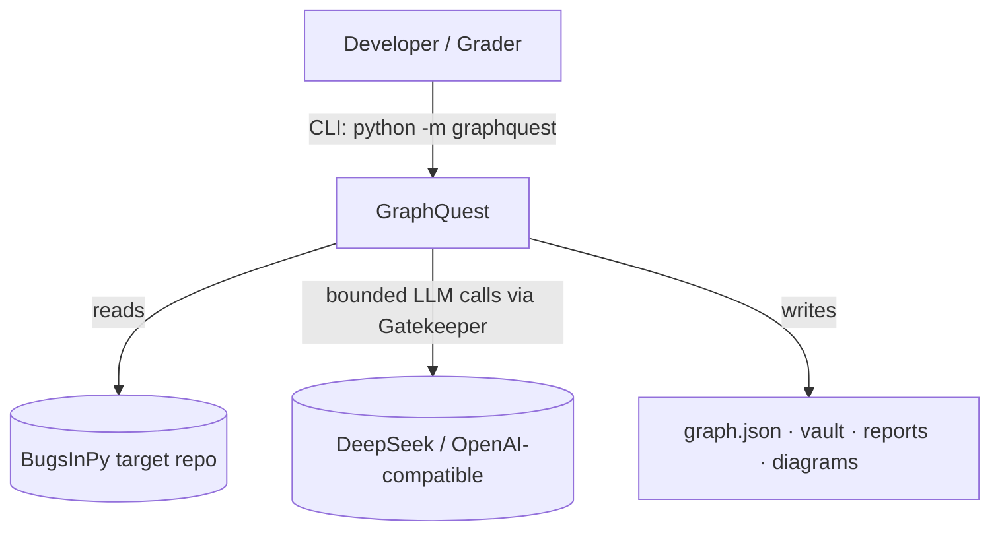
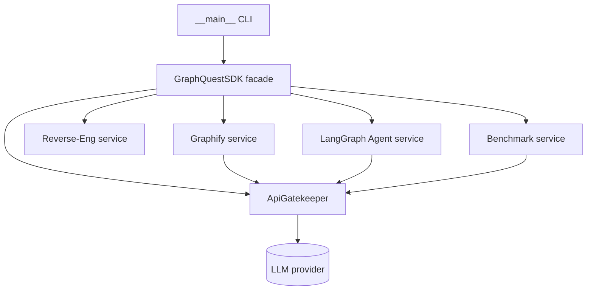
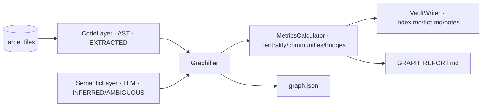
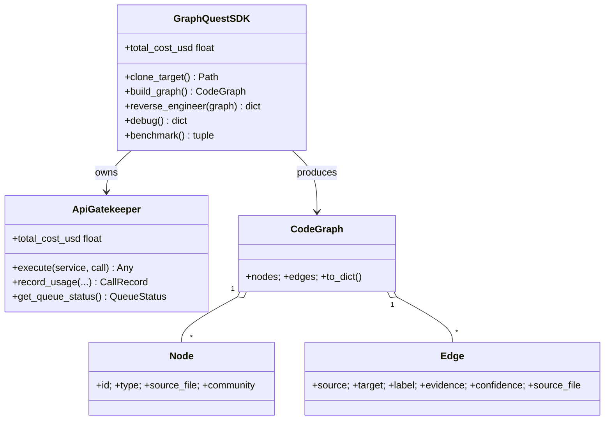
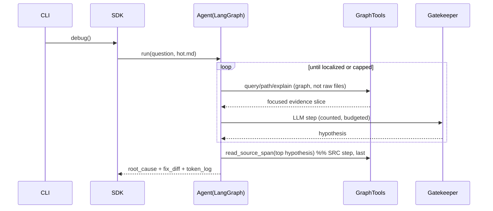

# PLAN — GraphQuest Architecture

> Version **1.00** · Companion to `PRD.md`. Diagrams are Mermaid (render in GitHub/Obsidian).

## 1. C4 Model

### C4-L1 Context


### C4-L2 Container


### C4-L3 Component — Graphify


## 2. UML — Class (core)


## 3. UML — Sequence (debug phase)


## 4. Architecture Decision Records

- **ADR-001 — Reimplement Graphify (AST + bounded LLM) rather than wrap a
  black box.** *Rationale:* the deterministic code layer must be token-free and
  reproducible; we control the `graph.json` schema the agent depends on.
  *Trade-off:* more code to own vs. full control + testability. *Alternatives:*
  call an external Graphify CLI (less control, possible cost/availability risk).
- **ADR-002 — LangGraph over CrewAI.** *Rationale:* explicit node graph gives
  per-step control of reads/iterations, matching the token-efficiency thesis;
  the assignment "Do" section recommends it under a small budget. *Trade-off:*
  no reuse of HW3 CrewAI patterns; offset by clearer token attribution.
- **ADR-003 — Graph-first / source-last retrieval.** *Rationale:* the whole
  saving comes from reading the smallest evidence slice; source files are opened
  only in the SRC validation step. *Trade-off:* needs a good graph; mitigated by
  EXTRACTED backbone.
- **ADR-004 — Single Gatekeeper for all LLM calls incl. semantic layer & agent.**
  *Rationale:* one budget ledger, one rate limiter, honest token accounting for
  the benchmark. *Trade-off:* slight indirection.
- **ADR-005 — DeepSeek (OpenAI-compatible) default.** *Rationale:* cheap,
  matches theme; swappable via `config`/`.env`. *Trade-off:* Hebrew/edge quality
  varies; not relevant to debugging task.

## 5. Data contracts

- `graph.json` — `{version, nodes[], edges[]}` per `services/graphify/models.py`.
- `hot.md` / `index.md` — Markdown with `[[wikilinks]]`; see `PRD_graphify.md`.
- `TOKEN_REPORT.md` — comparison table schema in `PRD_token_benchmark.md`.

## 6. Module map (≤150 LOC each)
```
src/graphquest/
  sdk/sdk.py                      facade (single entry point)
  shared/{config,gatekeeper,logging_setup,version}.py
  constants.py                    enums + filenames
  services/graphify/{models,code_layer,semantic_layer,metrics,vault_writer,graphifier}.py
  services/agent/{state,tools,nodes,workflow}.py
  services/benchmark/{models,baseline,comparator}.py  (+ guided arm reuses agent)
  services/reverse_engineering/diagrams.py
  __main__.py                     thin CLI
```
