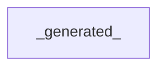

# Reverse-Engineering Report (EX04 §5.2)

> Block diagram + OOP schema derived FROM THE GRAPH, plus ≥2 insights.

## 1. Block / component architecture


## 2. OOP class schema
```mermaid
classDiagram
  _generated_
```

## 3. Architectural insights (≥2)
1. **God-node / bottleneck:** _node, degree/betweenness, hub-vs-bottleneck verdict, source._
2. **Traceability gap / isolated cluster:** _docs-without-code or orphan module._
